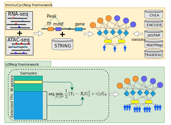

# ***ImmuCycReg-framework***

 [](https://github.com/mengxu98/ImmuCycReg-framework)  

The code repository is for paper: Integration of single sample and population analysis for understanding Immune evasion mechanisms of lung cancer.

## Workflow 

## DATA links:

🔸 Processed data from this study are available in the reproducibility GitHub repository: `https://github.com/mengxu98/ImmuCycReg-framework/tree/main/data`

🔸 The Cancer Genome Atlas (TCGA) and the Genotype-Tissue Expression (GTEx) datasets were downloaded from figshare: `https://figshare.com/articles/dataset/Data_record_1/5330539` `https://figshare.com/articles/dataset/Data_record_2/5330575` `https://figshare.com/articles/dataset/Data_record_3/5330593`

🔸 Transposase-Accessible Chromatin with high throughput sequencing (ATAC-seq) was downloaded from UCSC-Xena: `https://tcgaatacseq.s3.us-east-1.amazonaws.com/download/TCGA_ATAC_peak_Log2Counts_dedup_sample.gz` `https://tcgaatacseq.s3.us-east-1.amazonaws.com/download/TCGA_ATAC_peak.all.probeMap`

🔸 Copy number variations (CNV) dataset was downloaded from GISTIC2.0: `https://hgdownload.soe.ucsc.edu/goldenPath/hg38/bigZips/genes/hg38.ncbiRefSeq.gtf.gz`

🔸 Genome annotation file was downloaded from hg38.ensGene.gtf: `ftp://hgdownload.soe.ucsc.edu/goldenPath/hg38/bigZips/`

## The input data:

🔸 The TCGA RNA-seq is necessary

🔸 The ATAC-seq is necessary

🔸 The CNV data is not required

## The results provide in Supplementary Data:

`https://github.com/mengxu98/ImmuCycReg-framework/tree/main/data/Supplementary%20Data`

## The environment and softwares required:

``` r
R 4.1.2
NMF==0.24.0
DESeq2==1.32.0
L0Learn==2.0.3
e1071==1.7-11
glmnet==4.1-4
timeROC==0.4
rms==6.3-0
survival==3.3-1
ggplot2==3.3.6
```

``` bash
bedtools v2.27.167
PROMO: http://alggen.lsi.upc.es/cgi-bin/promo_v3/promo/promoinit.cgi?dirDB=TF_8.3

Cytoscape 3.8.2
ClueGo v2.5.9
JAVA v18.0.1.1
GeneNetWeaver: http://gnw.sourceforge.net/
```

## LICENSE

MIT License

## Cite

Li, X., Meng, X., Chen, H. et al. Integration of single sample and population analysis for understanding immune evasion mechanisms of lung cancer. npj Syst Biol Appl 9, 4 (2023). <https://doi.org/10.1038/s41540-023-00267-8>
